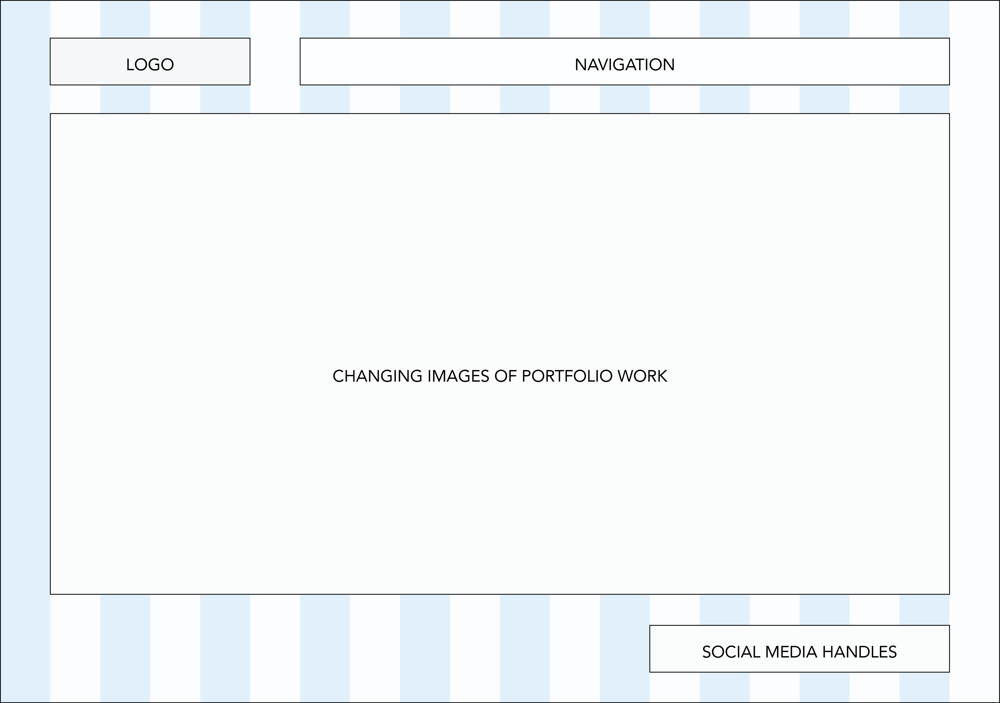
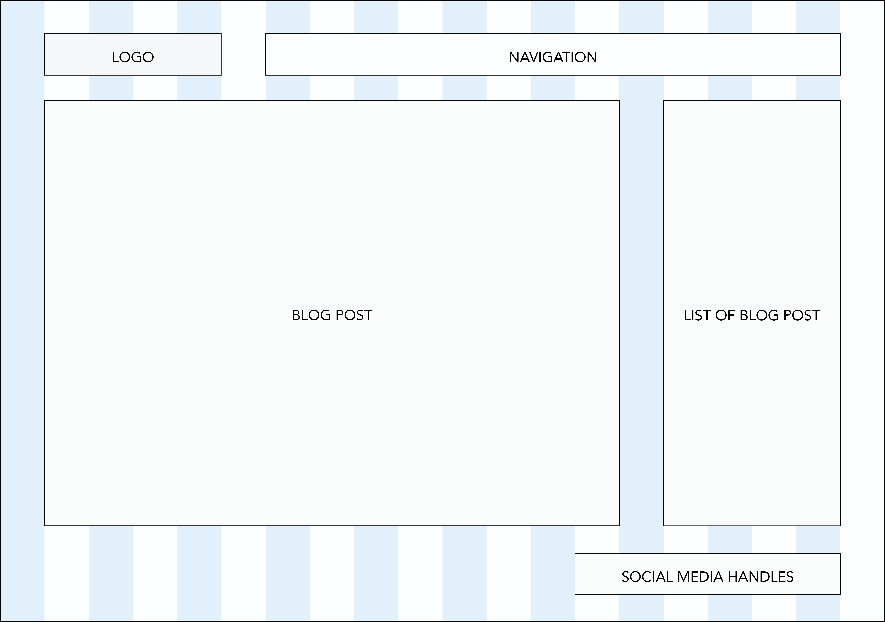

**What is a wireframe?**

A wireframe is a blueprint of the website that provides an overview of the information hierarchy, layout and navigation.

**What are the benefits of wireframing?**

Wireframing is beneficial as it allows the developer to explore how the websites structure will look like without being distracted by details including color palette, typographic and content.  Furthermore, as wireframes are typically easy to create and revise, the develop can make multiple iterations before development.

**Did you enjoy wireframing your site?**

It was fun to get a glimpse of what my site would look like.

**Did you revise your wireframe or stick with your first idea?**

I stuck with my original idea.  I may experiment with a few of the ideas and see if there is any other refinements I can make.

**What questions did you ask during this challenge? What resources did you find to help you answer them?**

I took a peek at some of the websites I like to visit and tried to see how they structured their site as a reference for my wireframes.

**Which parts of the challenge did you enjoy and which parts did you find tedious?**

I enjoyed creating the wireframes for my site. I used illustrator but I think I might try other tools to see what they have to offer if I needed to create any additional wireframes.  The weren't that many tedious excercises in this assignment.
