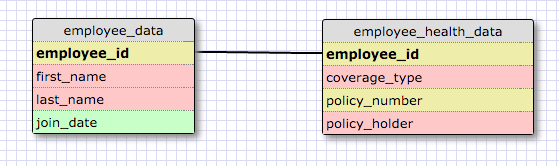
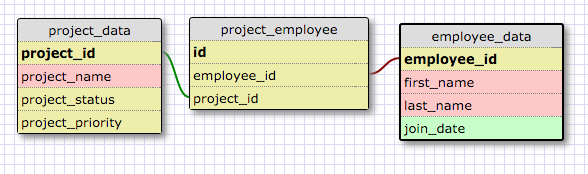
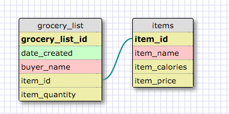

**One-to-One Relationship**

**Many-to-Many Relationship**

**Grocery List**

##Reflection##
**What is a one-to-one database?**
One-to-many relationships in the context of database structures refers to
when one data element can be referenced to many other elements.  For example, in our contact information, most people can have multiple mobile phone numbers but for the most part most mobile phone numbers belongs to just one person.

**When would you use a one-to-one database? (Think generally, not in terms of the example you created).**
You would use a one-to-one database relationship when you want to seperate
two tables from each other for performance reasons or for permissions reason.  Certain data mightnot always be needed and could be seperated to
another table but could be joined to other tables with a one-to-one relationship.

**What is a many-to-many database?**
A many-to-many relationship database is when one element in a table can
be related to multiple items in a different table. Said differentely,
a parent element in one table may have multiple child elements in another table.

**When would you use a many-to-many database? (Think generally, not in terms of the example you created).**
You would want to use many-to-many relationship in a database when
you want to store data that could be related to other tables that have
more than one relationship to each other.

**What is confusing about database schemas? What makes sense?**
The confusion comes when thinking about how to design the tables efficiently and how to illustrate them.